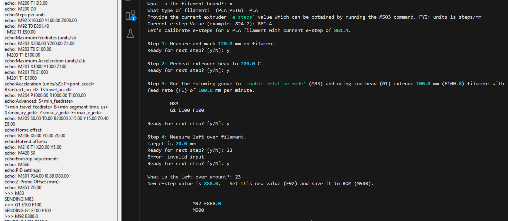

# 3dprint_flows
Interactive 3dprint workflows.

## Install as a package

Users can install as a package via this command:

```
pip install 3dprint_flows@git+https://github.com/chickenbit/3dprint_flows.git
```

## Usage

After installing, you can use via command line or in a script.  


```
prompt>calibrate
Provide the current extruder 'e-steps' value which can be obtained by running the M503 command. FYI: units is steps/mm
Current e-step Value (example: 824.7):
```

Here is an example usage showing the script prompts and usage on the right, and [Pronterface](https://www.pronterface.com/) on the left.  Pronterface is software one can use to interface with 3D Printers.  



# Future

Ideas for the future include:

* Setup connection with printer (Find and connect to 3D Printer via COM ports),
* Issue commands to printer and interpret responses to further automate the flow, and
* Save settings to disk (yaml or json file) so users could see how configurations have changed over time or load and set values from a file.

